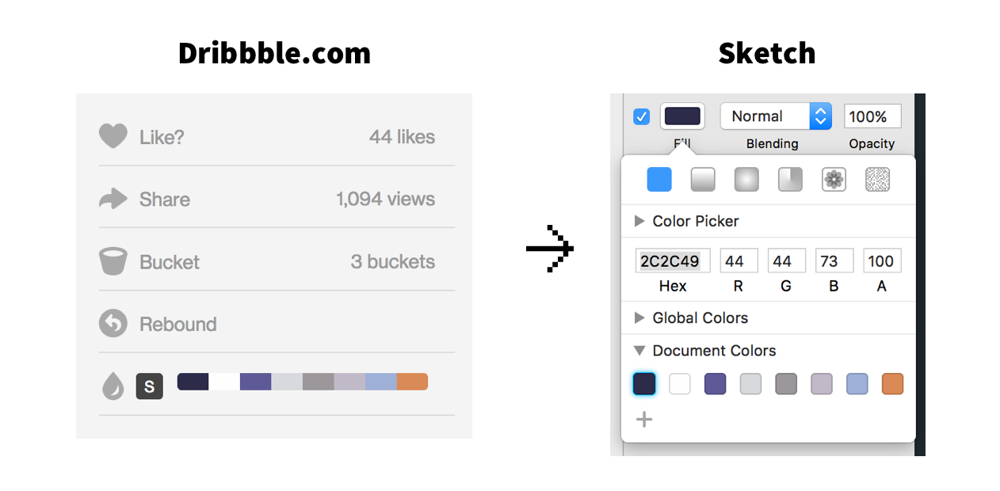

# Dribbble Color Palette Generator

Generate a .sketchpalette file from any dribbble shot's color palette to be loaded in [Sketch-Palette](https://github.com/andrewfiorillo/sketch-palettes) plugin.

## Usage

#### Saving Palette
Go to any dribbble shots, like [this one](https://dribbble.com/shots/2716060-Book-Detail-Screen) and click on the 'S' bttn in front of the color palette. Browser will notify you when the template is saved to `Downloads` folder.

#### Loading Palette in Sketch
Install [Sketch-Palette](https://github.com/andrewfiorillo/sketch-palettes)  plugin if you haven't yet. Once the plugin is installed, open Sketch and go to `Plugins > Load Palette` and select the file you just downloaded from your `Downloads` folder. 

## Authors

[Amie Chen](https://www.amie-chen.com)

## License

This project is licensed under the MIT License - see the [LICENSE.md](LICENSE.md) file for details

## Acknowledgments

* Chrome version of extension is coming up!

